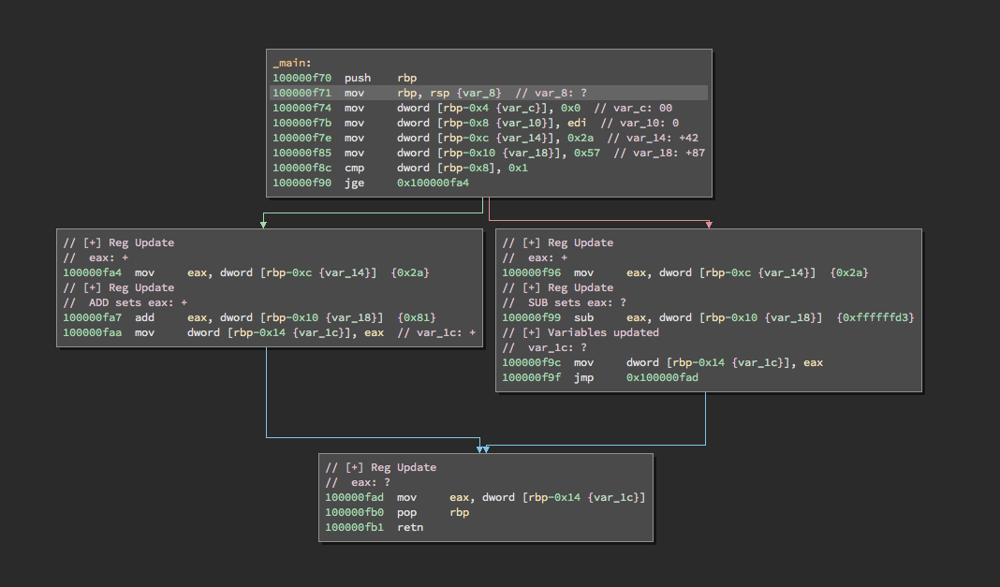

# signed_analysis.py
Abstract interpretation using lattices to analyse the possible sign of  a variable at any point in a program.

# binja_memcpy.py
A simple plugin demonstrating the binja headless api for python. Finds memcpy's and cooresponding src/dst information. The plguin can be moditified to find argument information for other function calls.

# walk_via_dfs.py
A plugin template to walk the binja CFG using the depth-first search algorithm (aka path sensitive, one path traversed at a time)

## Install
- Clone this repo

- Place walk_via_dfs.py and signed_analysis.py into your Binja Plugin folder, the usual location is: 
```/Users/<user>/Library/Application Support/Binary Ninja/plugins```

- Install binaryninja headless python API using this [script](https://gist.github.com/withzombies/c9ab65b878d05fa20878d6c2bfa935d9)

- Open a binary in Binary Ninja, right click on a function, and run either the signed analysis script or the dfs script.

- To run the memcpy script, cd into the directory it is in and run as a normal python script with the full path to you binary as the 2nd argument. Example: 
```python binja_memcpy.py /bin/bash```

## Example Signed Analysis of test.c

 
